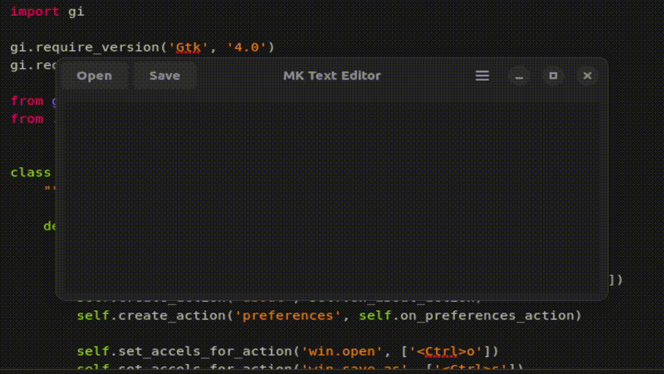

<h1 align="center">A Basic Text Editor App</h1>

  

  

  

  

This is a Linux designed basic text editor. This text editor can open, save and edit files and create new files of any file type. The purpose of this project was to gain familiarity with using the GTK/PyGObject UI library. Additionally I learned how to develop this app in a specific file structure so when I start my next project I can publish it to Flathub as a Flatpak app.

Watch the Full Video Demo Here

---

# Table of Contents
- [What I Learned](#what-i-learned-in-this-project)
- [Tools Used / Development Environment](#tools-used--development-environment)
- [How to Set Up](#how-to-set-up)
- [Project Overview](#project-overview)

---

# What I Learned in this Project
- How to work with GTK python apps that can be published to Flathub
- Programming with a new UI library PyGObject that uses GTK
- Planning and execution of a text editor from start to finish

# Tools Used / Development Environment
- [Builder IDE](https://flathub.org/apps/org.gnome.Builder)
- Python
- PyGObject/GTK
- Terminal
- Linux Mint

# How to Set Up
This project was implemented on my Linux desktop using information from the [PyGOject site](https://pygobject.gnome.org/getting_started.html#ubuntu-getting-started) and this [GTK YouTube Video.](https://youtu.be/Yu2EBmeCpJw?si=1T4h0TMkTJBPFGvC)
- Clone this repository 
- Open this codebase using the Flatpak Builder IDE app and click run.

# Project Overview
This is a Linux designed basic text editor. This text editor can open, save and edit files and create new files of any file type. The purpose of this project was to gain familiarity with using the GTK/PyGObject UI library. Additionally I learned how to develop this app in a specific file structure so when I start my next project I can publish it to Flathub as a Flatpak app.
This Text Editor has keybinds such as Ctrl+O and Ctrl+S to open and save files. The window title also changes to the opened file and has a credits/preferences page.

## Files and Structure
- `src/gtk/help-overlay.ui`: Contains the Keybinds information XML
- `src/main.py`: Contains the window create and entrance code 
- `src/window.py`: Contains the code for the open and save functionality
- `src/window.ui`: Contains the XML for the window header and text field features

## Future Work
Future improvements could include fully publishing this app but since there are many text editors on the flatpak store I don't see why mine would stand out. For features I would add the ability to save the window size and position after it is closed and editing features like cursor highlighting and find and replace.

--- 
